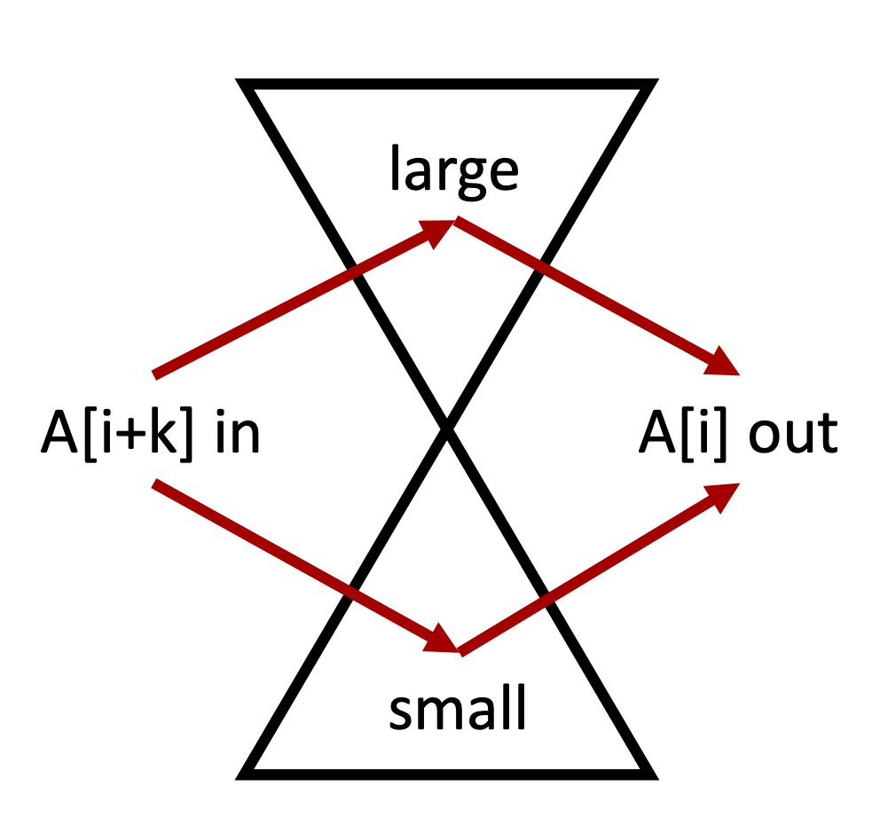

## 其他总结

### Swipe Keyboard
[Swipe Type Converter](https://codegolf.stackexchange.com/questions/39741/swipe-type-converter)    

### bitmask
Campus Bike II `如何分配人和车`     


### Sliding Window Mean/Min/Max/Median/Product

Sliding Window Mean `简单`    
Sliding Window Product  `记录0的个数`     
Sliding Window Max  `单调queue: 基于num popright，基于 idx popleft，最大值在队首`         
Sliding Window Min  `类似`    
Streaming Median `two heaps`     
[**Sliding Window Median**](https://leetcode.com/problems/sliding-window-median/discuss/262689/Python-Small-and-Large-Heaps) `初始化 sorted k-array, 进出, O (nk)` `初始化 balanced two heaps, 进出, O(nlogk)`    



### 数字归位 (idx 和 num 取值在同一范围)

[Find the only missing Number](https://leetcode.com/problems/missing-number/solution/)  `bit manipulation` `数字归位`   
[~~Single Number](https://leetcode.com/problems/single-number/discuss/42997/My-O(n)-solution-using-XOR) `big manipulation` `[4,1,2,1,2]`          
[Find the first missing Positive](https://leetcode.com/problems/first-missing-positive/discuss/17071/My-short-c%2B%2B-solution-O(1)-space-and-O(n)-time) `数字归位`    
[Find All Numbers Disappeared in an Array](https://leetcode.com/problems/find-all-numbers-disappeared-in-an-array/discuss/92955/Python-4-lines-with-short-explanation) `数字归位`    

```
算法：遍历数组，把 num 放到对应的 idx 上，超出范围就忽略
示意：num[i] -> num[num[i]]
idx: [0, 1, 2, 3, 4]
num: [3, 1,-1,10, 0]
num' [0, 1,-1, 3,10]
```


[Find the Duplicate Number](https://leetcode.com/problems/find-the-duplicate-number/solution/) `num[i] -> num[num[i]]` `duplicate形成环路``龟兔算法`    
[Couples Holding Hands](https://leetcode.com/problems/couples-holding-hands/discuss/117520/Java-union-find-easy-to-understand-5-ms) `UnionFind` `person2seat`    

[Max Chunks To Make Sorted I](https://leetcode.com/problems/max-chunks-to-make-sorted/solution/) `cut @ left_max_i == i`      
[Max Chunks To Make Sorted II (有重复值)](https://leetcode.com/problems/max-chunks-to-make-sorted-ii/discuss/113462/Java-solution-left-max-and-right-min.) `cut @ left_max_i <= right_min_(i+1)`      

```
idx: [0 1|2 3|4]
num: [1 0|3 2|4]
max: [1 1|3 3|4]
```


### 求数组交集 （简单）
Intersection of Two Arrays I (unique output) `set(nums1), 遍历 nums2`        
Intersection of Two Arrays II (repeated output) `dict(nums1), 遍历 nums2` `如果两个数组都很长，disk sort + two pointers`          
Intersection of Three Sorted Arrays (no duplicate) `three pointers`      

### 字符串表示 

#### `字符串表示 for subsequence` `char2idxs`

Is Subsequence? "acd"是"abcde"子串吗？**`双指针`**     
How many Subsequences? ["a", "bb", "acd", "ace"]哪些是"abcde"子串？ **`char2idxs`**    
**Shortest Way to Form String** 最少几个src “abc”可以包括tar “abcbcb”?       
[贪婪 O(nm) `(src:i<m; tar:j<n)`](https://leetcode.com/problems/shortest-way-to-form-string/discuss/309404/C%2B%2B-with-picture-greedy)       
[贪婪+二分查找 O(m+nlogm) `记录 char2idxs, find_next_tar[j]_after_i`](https://leetcode.com/problems/shortest-way-to-form-string/discuss/330938/Accept-is-not-enough-to-get-a-hire.-Interviewee-4-follow-up)      

#### `字符串表示 for strech` `char_repeat`  

**Expressive Words**  ["hello", "hi", "helo"]哪些可以 stretch 成 "heeellooo"?[`heeellooo表示为[helo][1323]；hello表示为[helo][1121]`](https://leetcode.com/problems/expressive-words/solution/)      

#### `字符串表示 for intersection_check` `bit_set: char_exists`

Maximum Product of Word Lengths 没有交集 [bit_set](https://leetcode.com/problems/maximum-product-of-word-lengths/solution/)    

#### `字符串表示 for grouping `  
Isomorphic Strings `apple <-> apply` `apple: 1,2,2,3,4`       
Group Isomorphic Strings `apple <-> apply, egg <-> ebb` `apple: 1,2,2,3,4`     
Group Shifted Strings `abd <-> bce <-> xya` `abd: 1,2`       
Group Anagrams `eat <-> ate <-> tea` `eat: a1b0..e1..t1..`     
