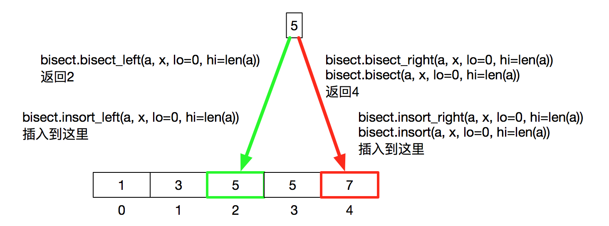

## Binary Search

### 还没做

**Smallest Good Base**          
**Max Sum of Rectangle No Larger Than K**             
**Preimage Size of Factorial Zeroes Function**         
**Russian Doll Envelopes**            
**Random Pick with Blacklist**            
**Find Right Interval**         
**Find K-th Smallest Pair Distance** `binary search + dp`         
**K-th Smallest Prime Fraction**    
**Nth Magical Number**           
**Kth Smallest Element in a BST**           


### search center
Peak Index in a Mountain Array         
Find Peak Element     
Guess Number Higher or Lower      
Binary Search Target        
Search in a Sorted Array of Unknown Size `find right first`       

### search leftmost/rightmost
Find Smallest Letter Greater Than Target  `leftmost`         
First Bad Version  `leftmost`         
Search Insert Position  `leftmost` `rightmost`                         
Find First and Last Position of Element in Sorted Array `leftmost` `rightmost`        
Check If a Number Is Majority Element in a Sorted Array `leftmost` `rightmost`      
Heaters (min radius to cover all house)  `每个house二分查找最近的heater`              
H-Index I `sort in descending order`       
H-Index II (ascending) `Binary Search`            
int sqrt(int x) `rightmost`      
Valid Perfect Square `16 (true) 14 (false)`     
Arranging Coins `n个硬币可以排几层楼梯？n>=1+2+..+m`             
Fixed Point `A[i]严格递增, 求 A[i]=i`      
Find K Closest Elements (to target in sorted array) [leftmost i, A[i] + A[i+k] >= 2x](https://leetcode.com/problems/find-k-closest-elements/discuss/106426/JavaC%2B%2BPython-Binary-Search-O(log(N-K)-%2B-K))        

### smart (烧脑题)
**Single Element in a Sorted Array** `(3 3)(7 7)(10 11)11` `找最左不配对`             
**Median of Two Sorted Arrays**  `二分查找最左 m1: A[m1]>=B[k-m1-1]`       
**Count (Complete Tree) Nodes** `binary search for the last leaf node`       
Search a 2D Matrix I (每行排序，大于之前行) `binary search`        
**Search a 2D Matrix II (每行排序，每列排序)** `从右上角，或者左下角开始`          

### rotated sorted array (通过 A[m] >=< A[r]?判断哪半边必定排序)
Find Minimum in Rotated Sorted Array I `binary search` `which half sorted`     
Find Minimum in Rotated Sorted Array II (duplicate) `A[m]==A[r]`       
Search in Rotated Sorted Array I `binary search` `which half sorted`        
Search in Rotated Sorted Array II (duplicate) `A[m]==A[r]`                  


### binary search on answer (需要快速验证答案)

[Split Array Largest Sum](https://leetcode.com/problems/split-array-largest-sum/discuss/89846/Python-solution-with-detailed-explanation)         
[Capacity To Ship Packages Within D Days](https://leetcode.com/problems/capacity-to-ship-packages-within-d-days/discuss/256729/JavaC%2B%2BPython-Binary-Search)          
[Minimize Max Distance to Gas Station](https://leetcode.com/problems/minimize-max-distance-to-gas-station/discuss/113633/C%2B%2BJavaPython-Binary-Search) (增加K个加油站，最大距离最小是多少？)        
Heaters (min radius to cover all house)  `每个house二分查找最近的heater`                     
[Koko Eating Bananas](https://leetcode.com/problems/koko-eating-bananas/discuss/152324/C%2B%2BJavaPython-Binary-Search)                 
[**Maximum Average Subarray II (subarray_len >= k)**](https://leetcode.com/problems/maximum-average-subarray-ii/discuss/105480/Java-solution-O(nlogM)-Binary-search-the-answer)         
~~Maximum Average Subarray I (subarray_len == k) `简单`        


### K-th

[**Kth Smallest Element in a Sorted Matrix**](https://leetcode.com/problems/kth-smallest-element-in-a-sorted-matrix/discuss/301357/Java-0ms-(added-Python-and-C%2B%2B)%3A-Easy-to-understand-solutions-using-Heap-and-Binary-Search) `bfs + heap(first_row)` `binary search + fast counting`        
[**Kth Smallest Number in Multiplication Table(乘法表)**](https://leetcode.com/problems/kth-smallest-number-in-multiplication-table/discuss/262279/Python-Binary-Search-Need-to-Return-the-Smallest-Candidate) `bfs + heap(first_row)` `binary search + fast counting`        
[**Find K Pairs with Smallest Sums (加法表)**](https://leetcode.com/problems/find-k-pairs-with-smallest-sums/discuss/84551/simple-Java-O(KlogK)-solution-with-explanation) `bfs + heap(first_row)`        


### DP with binary search
**Longest Increasing Subsequence** [`dp with binary search`](https://leetcode.com/problems/longest-increasing-subsequence/discuss/74824/JavaPython-Binary-search-O(nlogn)-time-with-explanation)          
**Super Egg Drop** `dp with binary search`         

Triplet Increasing Subsequence [LISS>=3](https://leetcode.com/problems/increasing-triplet-subsequence/discuss/79053/My-way-to-approach-such-a-problem.-How-to-think-about-it-Explanation-of-my-think-flow.)    


``` python
#### binary search center match(x) ####
while l <= r:
    mid = l + (r-l)//2
    direction = match(mid)
    if direction == FOUND:   return mid
    elif direction == LEFT:  r = mid - 1
    elif direction == RIGHT: l = mid + 1
return NotFound

#### binary search leftmost match(x) ####
#### 元素越右越正确，找最左
while l < r:
    mid = l + (r-l)//2       # mid 偏左
    if match(mid): r = mid
    else: l = mid + 1
if match(l): return l; else: ?  # 可能没有正确元素，需要检查

#### binary search rightmost match(x) ####
#### 元素越左越正确，找最右
while l < r: 
    mid = l + (r-l+1)//2     # mid 偏右
    if match(mid): l = mid
    else: r = mid - 1
if match(r): return r; else: ?  # 可能没有正确元素，需要检查

# bisect.bisect_left;  bisect.bisect_right
# bisect.insort_left;  bisect.insort_right
```

``` python
def min_rotated_sorted_array_unique(self, nums):
    l, r = 0, len(nums) - 1
    while l < r:
        m = l + (r - l) // 2
        if nums[m] > nums[r]:  # l_m sorted, rotated, min_to_right
            l = m + 1
        else:                  # m_r sorted, min_to_left
            r = m
    return nums[l]

def min_rotated_sorted_array_duplicate(self, nums):
    l, r = 0, len(nums) - 1
    while l < r:
        m = l + (r - l) // 2
        if nums[m] > nums[r]:  # l_m sorted, rotated, min_to_right
            l = m + 1
        elif nums[m] < nums[r]:  # m_r sorted, min_to_left
            r = m
        else:  # nums[m] == nums[r]
            if nums[l] > nums[m]:  # m_r sorted, rotated, min_to_left
               r = m
            elif nums[l] < nums[m]:  # l_m_r sorted
               return nums[l]
            else:  # nums[l] == nums[m] == nums[r]  # no idea
	            l, r = l+1, r-1               
    return nums[l]

def search_rotated_sorted_array_unique(self, nums, target):
    l, r = 0, len(nums) - 1
    while l <= r:
        m = l + (r - l)//2
        if nums[m] == target: return m
        if nums[m] > nums[r]:                      # l_m sorted; rotated
            if nums[l]<=target<nums[m]: r = m - 1  # target in l_m
            else: l = m + 1
        else:                                      # m_r sorted
            if nums[m]<target<=nums[r]: l = m + 1  # target in m_r
            else: r = m - 1
    return -1

def search_rotated_sorted_array_duplicate(self, nums, target):
    l, r = 0, len(nums) - 1
    while l <= r:
        m = l + (r - l)//2
        if nums[m] == target: return True
        if nums[m] > nums[r]:  # rotated, l_m sorted
            if nums[l]<=target<nums[m]: r = m - 1
            else: l = m + 1
        elif nums[m] < nums[r]:  # m_r sorted
            if nums[m]<target<=nums[r]: l = m + 1
            else: r = m - 1
        else:  # nums[m] == nums[r]
            if nums[l] > nums[m]:  # m_r same, rotated
                r = m - 1
            elif nums[l] < nums[m]:  # l_m sorted
                r = m - 1
            else:  # nums[l] == nums[m] == nums[r]
                l, r = l+1, r-1
    return False
```

