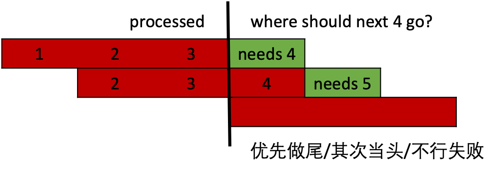
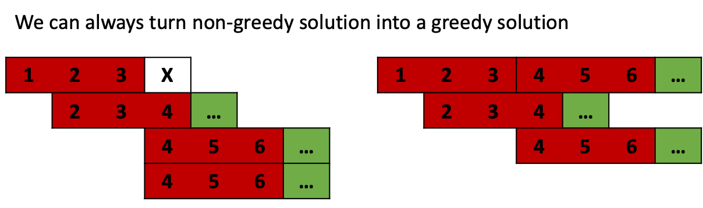

## Greedy

```
要证明：贪婪算法 >= 非贪婪算法
(1) 反证法：假设 (非贪婪算法 > 贪婪算法)
(2) 转化法：非贪婪算法 -> 贪婪算法
```

Split Array into Consecutive Subsequences [`扫描数组，优先做尾，其次当头，不行失败`](https://leetcode.com/problems/split-array-into-consecutive-subsequences/discuss/106514/Python-Easy-Understand-Greedy)      
 

Reorganize String (相同字符不相邻) `(most-common)s as separator`    
**Rearrange String k Distance Apart** `(most-common)s as separator`        
Task Scheduler `(most-common)s as separator`     

Is Subsequence? "acd"是"abcde"子串吗？**`双指针`**       
How many Subsequences? ["a", "bb", "acd", "ace"]哪些是"abcde"子串？ **`char2idxs`**    
**Shortest Way to Form String** 最少几个src “abc”可以包括tar “abcbcb”?       
[贪婪 O(nm)](https://leetcode.com/problems/shortest-way-to-form-string/discuss/309404/C%2B%2B-with-picture-greedy)`(src:i<m; tar:j<n)`       
[贪婪+二分查找 O(m+nlogm)](https://leetcode.com/problems/shortest-way-to-form-string/discuss/330938/Accept-is-not-enough-to-get-a-hire.-Interviewee-4-follow-up) `记录 char2idxs``find_next_tar[j]_after_i`     


Queue Reconstruction by Height (k 表示前面不矮的人数) [`从高个儿开始，按k插队`](https://leetcode.com/problems/queue-reconstruction-by-height/discuss/89359/Explanation-of-the-neat-Sort%2BInsert-solution)     

### 还没做

Score After Flipping Matrix     
Partition Labels        

Find Permutation    
Employee Free Time    
4 Keys Keyboard    
Lemonade Change     
Couples Holding Hands       
Best Time to Buy and Sell Stock with Transaction Fee        
Assign Cookies      
Is Subsequence      
Minimum Number of Arrows to Burst Balloons      
Monotone Increasing Digits      
Non-overlapping Intervals       
Advantage Shuffle       
Boats to Save People        
   

IPO     
Dota2 Senate        
Wiggle Subsequence      
Set Intersection Size At Least Two      
Split Array into Fibonacci Sequence     
Patching Array      
Gas Station     
Remove Duplicate Letters        
Course Schedule III     
Walking Robot Simulation        
Candy       
Remove K Digits     
Create Maximum Number       