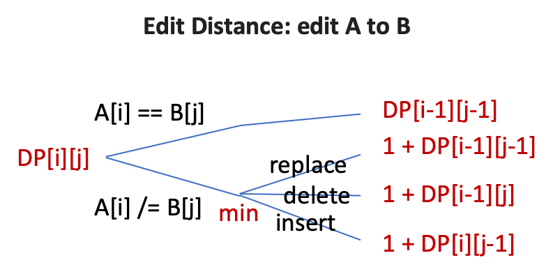
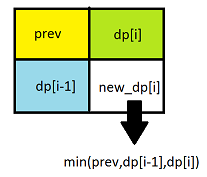

## DP = 子问题 + 递归(分类讨论) + TopDown/BottomUp

```
top down: easier to write, hard to optimize the memory usage
bottom up: hard to think, easier to optimize the meory usage
```

### 比较难想
[Divisor Game](https://leetcode.com/problems/divisor-game/discuss/295226/Python-1-liner-with-proof)  `偶数永远赢`        
[Paint Fence (number of ways) (N柱, K色, M连色)](https://leetcode.com/problems/paint-fence/discuss/178010/The-only-solution-you-need-to-read)  `dp[i][0..M-1]: paint i with same/dif color`                   
[Super Egg Drop](https://leetcode.com/problems/super-egg-drop/discuss/158974/C%2B%2BJavaPython-2D-and-1D-DP-O(KlogN))  `反向思考, dp[m摔, k蛋]可以检测几层楼？`            


### 单变量 f(n)
[Climbing Stairs](https://leetcode.com/problems/climbing-stairs/discuss/25299/Basically-it's-a-fibonacci.) `f(n) = f(n-1) + f(n-2)`      
New 21 Game `dp[n]: prob of getting n points`        
Unique Binary Search Trees I `f(n) = sum(f(i)*f(n-1-i) for i in range(n))`      
Unique Binary Search Trees II `map k to list of nodes`     


### 多变量 f(m, n, ...)
Unique Paths I  `f(m, n) = f(m-1, n) + f(m, n-1)`        
Unique Paths II (obstacles) `f(m, n) = f(m-1, n) + f(m, n-1), or 0 (obstacle)`     
Minimum Path Sum `D(i,j) = 1 + min(D(i,j-1), D(i-1,j))`[Dijkstra](https://leetcode.com/problems/minimum-path-sum/discuss/360106/Python-Dijkstra-explained-and-commented)        
**[Cherry Pickup](https://leetcode.com/problems/cherry-pickup/solution/)** `往返摘樱桃` `两个人同时走`  dp( r1, c1, r2 <strike>, c2</strike> )        
**[Dungeon Game](https://leetcode.com/problems/dungeon-game/discuss/52826/a-very-clean-and-intuitive-solution-with-explanation)** `必须反向推导DP`        
**[Super Egg Drop](https://leetcode.com/problems/super-egg-drop/discuss/158974/C%2B%2BJavaPython-2D-and-1D-DP-O(KlogN))** `反向思考, dp[m摔, k蛋]可以检测几层楼？`       


### 单序列
Decode Ways I  `dp[i] for s[..@i]` `分类讨论 0,1-9`          
Decode Ways II (wildcard)  `dp[i] for s[..@i]` `分类讨论 *,0,1-9`          

Word Break I (is possible)  `dp[i] for s[..@i]` `dp[i,j]: break s[@i..@j]`             
Word Break II (all results) `记录 split points, backtracking`      

[Maximum Subarray](https://leetcode.com/problems/maximum-subarray/discuss/20194/A-Python-solution) `dp[i]: maximum subarray ending with N[i]`                      
Best Time to Buy and Sell Stock I (at most 1 transaction) `价格差：max subarray sum, DP`     
Best Time to Buy and Sell Stock II (infinite transactions) `累加正差`    

[Min Cost Climbing Stairs](https://leetcode.com/problems/min-cost-climbing-stairs/discuss/110104/Easy-to-understand-Python-solution-O(1)-space)  `dp[i] for s[..@i]`         
House Robber I  `dp[i]: max money from A[..i], dp[i] = max(dp[i-1], dp[i-2]+ A[i])` `dp[i]: max money from A[..@i], dp[i] = A[i] + max(dp[i-2], dp[i-3])`         
House Robber II (circular) `掐头 or 去尾`      
House Robber II (binary tree) `return (rob_it, dont_rob)` `注意不 rob root 并不意味着必须 rob 子节点`   


**Burst Balloons**  `DP[i][j], 遍历 which last`     


### 单序列 + 单变量
[Paint Fence (number of ways) 最多相邻两根同色](https://leetcode.com/problems/paint-fence/discuss/178010/The-only-solution-you-need-to-read)  `dp[i][same/dif]: paint i with same/dif color`                   
[Paint House I](https://leetcode.com/problems/paint-house/discuss/68203/Share-my-very-simple-Java-solution-with-explanation.)  `dp[i][color]: paint i with color`       
Paint House II `dp[i][color]: paint i with color`       

**[Odd Even Jump](https://leetcode.com/problems/odd-even-jump/discuss/217981/JavaC%2B%2BPython-DP-idea-Using-TreeMap-or-Stack)** 奇跳高，偶跳低     
`next_min_higher, next_max_lower`     
`higher[i] = lower[next_min_higher[i]]`     
`lower[i] = higher[next_max_lower[i]]`      

**[Minimum Swaps To Make Sequences Increasing](https://leetcode.com/problems/minimum-swaps-to-make-sequences-increasing/discuss/119835/Java-O(n)-DP-Solution)**      
`dp[i][swap_or_not]`         
`观察(i-1,i)之间的联动效应; 不能反动，则必须联动; 不能联动，则必须反动; 其他情况，可自由行动`      

Best Time to Buy and Sell Stock III (k transactions) `dp[k][t] for k transactions on s[..t]`         
<!--**Best Time to Buy and Sell Stock IV**       
**Best Time to Buy and Sell Stock with Transaction Fee**         
**Best Time to Buy and Sell Stock with Cooldown**        -->

``` python
def buyStock(prices, n_trans):
    n_days = len(prices)
    if n_days <= 1 or n_trans <= 0: return 0
    dp = [[0] * n_days for _ in range(n_trans + 1)]    
    for k in range(1, n_trans+1):
        for t in range(1, n_days):
            dp[k][t] = dp[k][t-1]  # 不交易
            for i in range(t):     # 交易
                dp[k][t] = max(dp[k][t], dp[k-1][i] + prices[t] - prices[i])
    return dp[-1][-1]
```


### 双序列 `dp[i][j] for s[..@i] and t[..@j]`
[Is Subsequence](https://leetcode.com/problems/is-subsequence/discuss/87421/Python-simple-solution)  `双指针`     
[How many Subsequences](https://leetcode.com/problems/number-of-matching-subsequences/discuss/117578/Simple-Python-solution) `char2idxs + binary search`      

[Longest Common Subsequence](https://leetcode.com/problems/longest-common-subsequence/discuss/348884/C%2B%2B-with-picture-O(nm)) `LCS(s1+c1,s2+c2)=?` `max(左,上,斜(+1/0))`       
[**Shortest** Common **Supersequence**](https://leetcode.com/problems/shortest-common-supersequence/discuss/313542/My-python-2D-DP-Solution) `SCS(s1+c1,s2+c2)=?``记录递归路径，回溯结果`          
[Longest Repeating Substring](https://leetcode.com/problems/longest-repeating-substring/discuss/307691/Python3-O(n*log(n))-solution-in-Binary-Search-%2B-Rolling-Hash) `Binary Search`      
`Check if there is a duplicate substring of length L:Rolling Hash`      

Edit Distance  `dp[i][j] for s[..@i] and t[..@j]`      
     
Is One Edit Distance `greedy`       
Delete Operation for Two Strings `longest common subsequence`         
<!--Minimum ASCII Delete Sum for Two Strings         -->
Regular Expression Matching        
Wildcard Matching         

``` python
def number_Of_Edit(w1, w2):
    m, n = len(w1), len(w2)
    dp = [ [0] * (n + 1) for _ in range(m + 1)]
    for i in range(m + 1): dp[i][0] = i
    for j in range(n + 1): dp[0][j] = j
    for i in range(1, m + 1):
        for j in range(1, n + 1):
            dp[i][j] = min(dp[i-1][j] + 1, dp[i][j-1] + 1,
                           dp[i-1][j-1] + (word1[i-1] != word2[j-1]))
    return dp[m][n]

def longest_Common_Subsequence(w1, w2):
    m, n = len(w1), len(w2)
    dp = [[0] * (n + 1) for _ in range(m + 1)]
    for i in range(1, m+1):
        for j in range(1, n+1):
            top, left, topleft = dp[i-1][j], dp[i][j-1], dp[i-1][j-1]
            dp[i][j] = max(top, left, topleft + (w1[i-1] == w2[j-1]))
    return dp[m][n]

def numberOfDelete(w1, w2):
    return len(w1) + len(w2) - 2 * longest_Common_Subsequence(w1, w2)

def is_One_Edit_Distance(s, t):
    if s == t: return False
    m, n = len(s), len(t)
    if m > n: return is_One_Edit_Distance(t, s) # force m <= n        
    if n - m > 1: return False
    for i in range(l1):
        if s[i] != t[i]:
            if m == n: s = s[:i]+t[i]+s[i+1:]  # replacement
            else: s = s[:i]+t[i]+s[i:]  # insertion
            break
    return s == t or s == t[:-1]

def regular_Expression_Matching(s, p):
    m, n = len(s), len(p)
    dp = [[False] * (n + 1) for _ in range(m + 1)]
    dp[0][0] = True
    for i, c in enumerate(p):
        if c == '*': dp[0][i+1] = dp[0][i-1]
    for i in range(1, m+1):
        for j in range(1, n+1):
            if p[j-1] == s[i-1] or p[j-1]=='.':  # char matched
                dp[i][j] = dp[i-1][j-1]
            elif p[j-1] == '*':
                dp[i][j] = dp[i][j-2]   # repeat 0 time
                if p[j-2] == s[i-1] or p[j-2]=='.': dp[i][j] |= dp[i-1][j]
            # else: dp[i][j] = False
    return dp[m][n]

def wildcard_Matching(s, p):
    m, n = len(s), len(p)   
    dp = [[False] * (n + 1) for _ in range(m + 1)]
    dp[0][0] = True
    for i, c in enumerate(p):
        if c == '*': dp[0][i+1] = dp[0][i]    
    for i in range(1, m+1):
        for j in range(1, n+1):
            if p[j-1] == s[i-1] or p[j-1] == '?': # char matched
                dp[i][j] = dp[i-1][j-1]
            elif p[j-1] == '*':
                dp[i][j] = dp[i][j-1] or dp[i-1][j]
            # else: dp[i][j] = False
    return dp[m][n]
```

### 矩阵

Bomb Enemy   `遇墙后，重新计算rowKill, colKills`      
Longest Line of Consecutive One in Matrix  `dp[i][j][0/1/2/3]`                   
Maximal Square `通用 O(n^3): 2D前缀和` `更快 O(n^2): min(左,上,斜)+1`           
     
Maximal Rectangle `dp[i] for M[..@i]` `转化为📊最大矩形`        
Seam Carving [`wiki`](https://en.wikipedia.org/wiki/Seam_carving)     

### 背包问题

Integer Break   `3a + 2b`     
Target Sum `dp(nums, target) + memo`       
Coin Change 2 [`dp[target][:k] = dp[target][:k-1] + dp[target-coin_k][:k]`](https://leetcode.com/problems/coin-change-2/discuss/99210/python-O(n)-space-dp-solution)    

### 不用DP，用BFS更快
Perfect Squares `BFS`       
Coin Change  `BFS`       

### subarray, substring

[Maximum Subarray](https://leetcode.com/problems/maximum-subarray/discuss/20194/A-Python-solution) `dp[i]: maximum subarray ending with N[i]`        
Maximum Product Subarray `负负得正` `maximum, minimum`        
Max Sum of Rectangle  `left,right,max subarray sum`           
Max Sum of Rectangle No Larger Than K `left,right,max subarray sum <= k` `cumsum[j]-x<=k`                    
**Maximum Length of Repeated Subarray**      
**Maximum Sum of 3 Non-Overlapping Subarrays**       
**Bitwise ORs of Subarrays**         
**Continuous Subarray Sum**      
Longest Palindromic Substring  `dp[i][j]: s[@i..@j] is panlindromic`       
Longest Valid Parentheses  `dp[i] for s[..@i]` `前左 ?()` `前右 ??(--))`         
**Palindromic Substrings**       
**Palindrome Partitioning II**       
**Unique Substrings in Wraparound String**       


### subsequence

**Distinct Subsequences**        
**Wiggle Subsequence**       

**Count Different Palindromic Subsequences**         

**Minimum Window Subsequence**     

**Longest Increasing Continuous Subsequence** ` `      
**Longest Increasing Subsequence**       
**Number of Longest Increasing Subsequence**          


Russian Doll Envelopes 可乱序取，不可旋转 (高宽互换) [`按宽度排序，高度反排序 O(nlogn)` `算最长增长子序列 O(nlogn)`](https://leetcode.com/problems/russian-doll-envelopes/discuss/82796/A-Trick-to-solve-this-problem.)      
Russian Doll Envelopes 不可乱序取，不可旋转 `DAG`       
Russian Doll Envelopes 可乱序取，可旋转 `DFS`      


**Longest Fibonacci Subsequence**      

**Longest Palindromic Subsequence** `dp[i][j]: longest in s[i..j]`      

### 没分类
Sentence Screen Fitting `指针：abc_de_f_`        
Split Array Largest Sum (n个数切m段，最大值最小化) `dp[i][@j] A[0..j]切 i 段` `非负数情况，二分查找+贪婪验证`     
Shortest Way to Form String () ``

### 还没做

Counting Bits        
Number Of Corner Rectangles    
Stone Game       
Arithmetic Slices        
Arithmetic Slices II - Subsequence       

2 Keys Keyboard      
4 Keys Keyboard     

Maximum Length of Pair Chain         
Count Numbers with Unique Digits         
Shopping Offers      

Predict the Winner       

Android Unlock Patterns    

Delete and Earn      

Encode String with Shortest Length    

Combination Sum IV       
Shortest Path Visiting All Nodes         


Largest Sum of Averages      


Push Dominoes        
Largest Plus Sign        


Knight Probability in Chessboard         


Freedom Trail        

Valid Permutations for DI Sequence       

Partition Equal Subset Sum       
Ones and Zeroes      
Partition to K Equal Sum Subsets         
Remove Boxes         

Triangle         
Super Washing Machines       
Guess Number Higher or Lower II      

Maximum Vacation Days        
Stickers to Spell Word       

Strange Printer      
Soup Servings        

Ugly Number II       
Range Sum Query - Immutable      
Largest Divisible Subset         
Domino and Tromino Tiling        
Frog Jump        


Concatenated Words       
Profitable Schemes       
Non-negative Integers without Consecutive Ones       

Student Attendance Record II         


Out of Boundary Paths        
Scramble String      
Cheapest Flights Within K Stops      
Race Car         


K Inverse Pairs Array        

Count The Repetitions        
Interleaving String      
Can I Win        

Minimum Number of Refueling Stops        
Coin Path     


Numbers At Most N Given Digit Set        
[Create Maximum Number](https://leetcode.com/problems/create-maximum-number/discuss/77291/Share-my-Python-solution-with-explanation) `'39', '89', k=3, out='989'` `mergeTwo(maxOne(n1, k1), maxOne(n2, k-k1))`       


