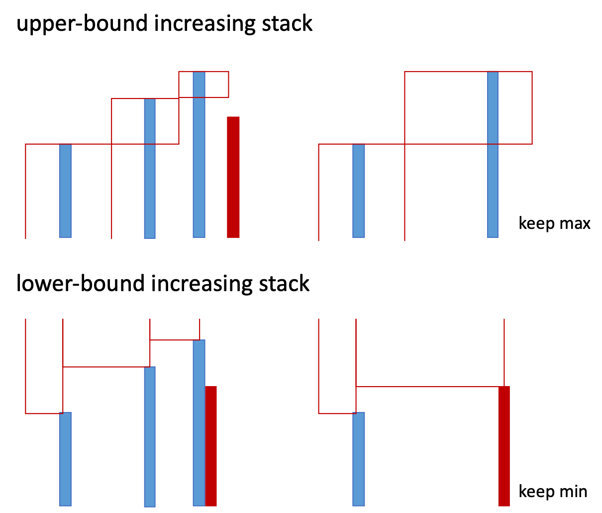
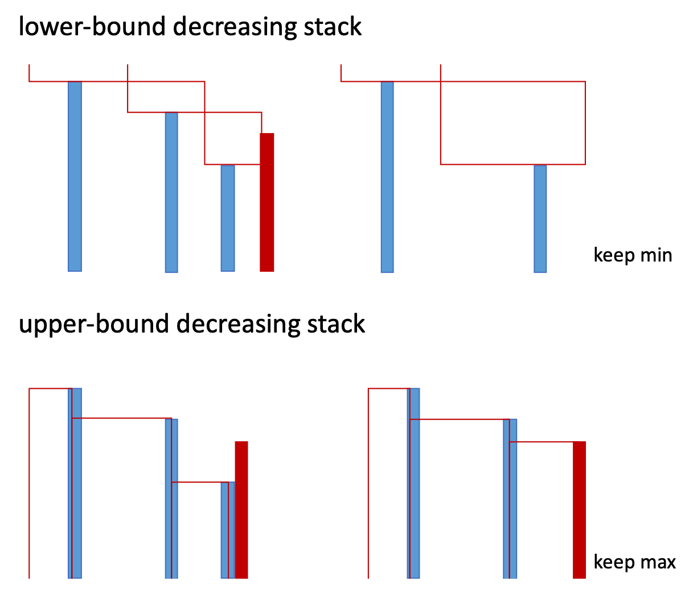

## Stack

### 单调栈 (next\_larger/smaller; next\_minLarger; next\_maxSmaller)    

Min Stack (平均空间复杂度?)        
Next Greater Element I      
Next Greater Element II (Circular) `复制双份`     
Next Greater Node In Linked List      
Daily Temperatures (Next Warmer Day)      
Online Stock Span [`prev_larger`](https://leetcode.com/problems/online-stock-span/discuss/168311/C%2B%2BJavaPython-O(1))      

**Next Greater Element** `单调栈 (idx, num)`      
**Next Smallest Greater Element** `单调栈 (num, idx)``argsort`         
**Odd Even Jump** `next_min_higher, next_max_lower`     

Trapping Rain Water 📊 `每个点能接多少水？``min(max_l, max_r)-h` `单调栈: cur-top @ pop`        
Largest Rectangle in Histogram 📊 `单调栈: cur-top @ pop`      
Maximal Rectangle `上一题变种`     

**132 Pattern** `cur; left_min; right_max_smaller`        

Sum of Subarray Minimums [`每个值找到 prev_smaller, next_smaller`](https://leetcode.com/problems/sum-of-subarray-minimums/discuss/178876/stack-solution-with-very-detailed-explanation-step-by-step)      
Minimum Cost Tree From Leaf Values [`每个 Node 屏蔽掉较小值 a，Node 取值 a * min(prev_larger, next_larger)`](https://leetcode.com/problems/minimum-cost-tree-from-leaf-values/discuss/339959/One-Pass-O(N)-Time-and-Space)       
**Number of Valid Subarrays (valid subarray: 最左端最小)** [`每次pop计算从此处开始的 valid subarray`](https://leetcode.com/problems/number-of-valid-subarrays/discuss/318895/Python-O(n)-stack)     

Remove K Digits (to make smallest) `1321删1个最小是121` [`递增栈`](https://leetcode.com/problems/remove-k-digits/discuss/88668/Short-Python-one-O(n)-and-one-RegEx)            
Remove Duplicate Letters (to make smallest) `cbacdcbc``=>``acdb(字典序最小)`[monotone stack](https://leetcode.com/problems/remove-duplicate-letters/discuss/76787/Some-Python-solutions)      

Shortest Unsorted Continuous Subarray (to make sorted) [`向右递增栈，最左pop``向左递减，最右pop`]((https://leetcode.com/problems/shortest-unsorted-continuous-subarray/solution/))      

Car Fleet 车头顶车尾 [`sort by 出发地, monotone stack by 到达时间`]()  

### Upperbound monostack
Max Chunks To Make Sorted I (无重复)      
Max Chunks To Make Sorted II (有重复)      

### 单调队列

Sliding Window Maximum [monotone queue](https://leetcode.com/problems/sliding-window-maximum/discuss/111560/Python-O(n)-solution-using-deque-with-comments)       
**Shortest Subarray Sum >= K (有负数)** `S[j] - x >= k` `rightmost i, Si <= Sj-K` [**`mono queue as solution space`**](https://leetcode.com/problems/shortest-subarray-with-sum-at-least-k/discuss/143726/C%2B%2BJavaPython-O(N)-Using-Deque)               

### Tree
Binary Tree Preorder Traversal      
Binary Tree Inorder Traversal      
Binary Tree Postorder Traversal      
Binary Tree Zigzag Level Order Traversal      
Verify Preorder Serialization of a Binary Tree      
Verify Preorder Sequence in Binary Search Tree         
Binary Search Tree Iterator      
Closest Binary Search Tree Value II      
Minimum Cost Tree From Leaf Values   

### Stack
Implement Stack using Queues      
Implement Queue using Stacks      

### 括号
Valid Parentheses      
Minimum Remove to Make Valid Parentheses      
[Score of Parentheses](https://leetcode.com/problems/score-of-parentheses/discuss/141777/C%2B%2BJavaPython-O(1)-Space)       
Remove Outermost Parentheses      
Minimum Add to Make Parentheses Valid      
Reverse Substrings Between Each Pair of Parentheses      

### String
Simplify Path `/a/../../b/../c//.//``=>``/c`     
Decode String `3[a2[c]]``=>``accaccacc`     
Decoded String at Index `反其道而行之`     
Evaluate Reverse Polish Notation `逆波兰表达式``4,13,5,/,+``=>``6`     
Remove All Adjacent Duplicates In String I `有唯一解``abbaca``=>``ca`    
Remove All Adjacent Duplicates in String II `有唯一解``deeedbbcccbdaa (k=3)``=>``aa`     
Number of Atoms `难题``K4(ON(SO3)2)2``=>``K4 N2 O14 S4`     

### Calculator (优先级) 

Basic Calculator I, II, III  [numStack, opStack](https://leetcode.com/problems/basic-calculator-iii/discuss/202979/A-generic-solution-for-Basic-Calculator-I-II-III)       
**Basic Calculator IV**      

### Nested List 
Flatten Nested List Iterator      
Mini Parser for Nested List         

### Others

Baseball Game      
Exclusive Time of Functions      

Asteroid Collision      

Maximum Frequency Stack      

Backspace String Compare      

Tag Validator      
Validate Stack Sequences      

Ternary Expression Parser      

Check If Word Is Valid After Substitutions      
Longest Well-Performing Interval      

