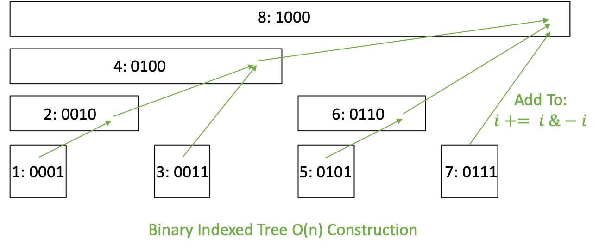
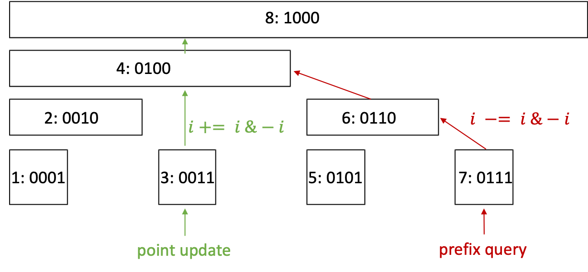

## Prefix/Range Sum/Max/Min (no update)
Range Sum Query 1D - Immutable `B = AB-A`      
Range Sum Query 2D - Immutable `D = ABCD+A-AB-AC` `rowwise & colwise`     
Product of Array Except Self `preProduct, postProduct`      
Partition Array into Disjoint Intervals  `preMax, postMin`                      
Trapping Rain Water I `preMax, postMax` `bfs: heap[boundary], max_visited`    
Trapping Rain Water II `bfs: heap[boundary], max_visited`    

## Binary Indexed Tree (prefix sum with update)
[Youtue Video on Binary Indexed Tree](https://www.youtube.com/watch?v=RgITNht_f4Q&list=PLDV1Zeh2NRsCvoyP-bztk6uXAYoyZg_U9)    

BIT O(n) Construction ``       
      

**BIT (range update, point query)** `derivative as delta`     

Range Sum Query 1D - Mutable  `BIT`      
Range Sum Query 2D - Mutable `BIT-2D`       
Count of Smaller Numbers After Self  [`BIT` `num2rank` `rank2rank[i]=i-1`]()                            
Reverse Pairs (Count of Twice Smaller Numbers After Self)          
`BIT` `num2rank` `rank2rank[i]: binary search`                     

<!--
**k-th tallest given height count** `O(log^2(n))`     

-->
 

``` python
"""Binary Indexed Tree"""
class BinaryIndexedTree(object):
    def __init__(self, nums):
        self.sums = [0] * (len(nums) + 1)
        for i, val in enumerate(nums):
            self.update(i, val)

    def update(self, i, val):
        i += 1
        while i < len(self.sums):
            self.sums[i] += 1
            i += i & -i

    def prefix_sum(self, i):
        i += 1
        res = 0
        while i > 0:
            res += self.sums[i]
            i -= i & -i           # get parent
        return res
     
    def range_sum(self, i, j):
        return self.prefix_sum(j) - self.prefix_sum(i-1)
```

Segment Tree: <br/>

<br/><br/>
Binary Indexed Tree: <br/>

<br/><br/>
Compare: <br/>
