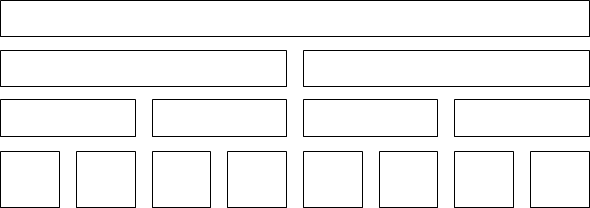
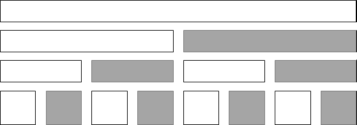

## Segment Tree (range sum/max/min with update)

```
太复杂，一般不考，range sum 能用 Binary Indexed Tree 代替，range max/min 没办法
```

**Range Module**            
**My Calendar III**         
**Rectangle Area II**           
**Falling Squares**         

``` python
""" Segment Tree (low, high, query, delta) 
Here, the query is for minimum, the delta is to increment.
For other queries and deltas, 
we need to modify the "prop" & "update" functions accordingly
"""
lchild = lambda p: 2*p + 1
rchild = lambda p: 2*p + 2
parent = lambda p: (p-1) // 2

class SegmentTree(object):
    def __init__(self, array):
        n = len(array)
        self.array = array
        self.low = [0] * (4 * n)
        self.high = [0] * (4 * n)
        self.query = [0] * (4 * n)
        self.delta = [0] * (4 * n)
        self.buildTree(p=0, i=0, j=n-1)

    def buildTree(self, p, i, j):
        low, high, query, array = self.low, self.high, self.query, self.array
        low[p], high[p] = i, j
        if i == j:
            query[p] = array[i]  """need to modify"""
        else: # i < j
            mid = i + (j-i)//2
            self.buildTree(lchild(p), i, mid)
            self.buildTree(rchild(p), mid+1, j)
            self.update(p)

    """need to modify"""
    def prop(self, p):
        delta = self.delta
        delta[lchild(p)] += delta[p]
        delta[rchild(p)] += delta[p]
        delta[p] = 0

    """need to modify"""
    def update(self, p):
        query, delta = self.query, self.delta
        lc, rc = lchild(p), rchild(p)
        query[p] = min(query[lc] + delta[lc], query[rc] + delta[rc])

    def range_delta(self, i, j, val, p=0):
        lo, hi = self.low[p], self.high[p]
        if j < lo or hi < i:         # no overlap
            return
        elif i <= lo and hi <= j:    # total overlap
            self.delta[p] += val  """need to modify"""
        else:                        # partial overlap
            self.prop(p)
            self.range_delta(i, j, val, lchild(p))
            self.range_delta(i, j, val, rchild(p))
            self.update(p)

    def range_query(self, i, j, p=0):
        lo, hi = self.low[p], self.high[p]
        if j < lo or hi < i:         # no overlap
            return math.inf
        elif i <= lo and hi <= j:    # total overlap
            return self.query[p] + self.delta[p]  """need to modify"""
        else:                        # partial overlap
            self.prop(p)
            left_query = self.range_query(i, j, lchild(p))
            right_query = self.range_query(i, j, rchild(p)))
            self.update(p)
            return min(left_query, right_query)  """need to modify"""
```

Segment Tree: <br/>

<br/><br/>
Compare with Binary Indexed Tree: <br/>
