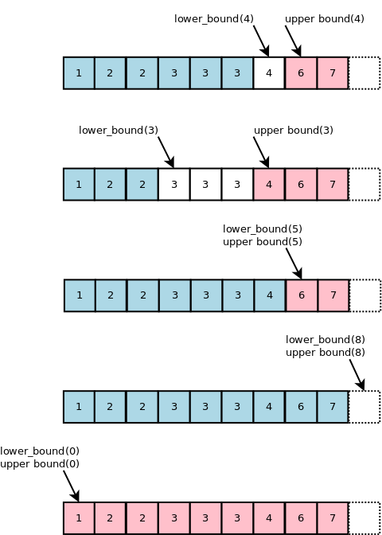
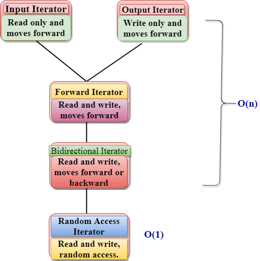

## C++ 常见用法 
`pointer is an address`    
`reference is an alias`       

```cpp
/* Hello World */
#include <iostream>
int main() {
    std::cout << "Hello, World!" << std::endl;
    return 0;
}
```
``` cpp
/* control */
if (condition1) {}
else if (condition2) {} 
else {}

for (int i=0; i<5; i++) {}

while(condition) {}
```
```cpp
/* types */
unsigned char/short/int/long;
float, double;
char name[] = "Yang";
char* name = "Yang";
int array[5];
int array[5][5];
```
``` cpp
/* operators */
+, -, *, /, %
<, <=, >, >=, ==, !=
&&, ||, !  //logical operator
&, |, <<, >>, ~, ^   //bitwise operator
```
``` cpp
/* cmath */
#include <cmath>
// abs, pow, sqrt
// ceil, floor, round
// exp, log, log2, log10 ...
// sin, cos, tan, sinh, cosh, tanh ...
```

```cpp
/* c_array -> std::array*/
int arr[] = {1,2,3,4,5};
std::array<int, 5> arr;

/* c_string -> std::string*/
char str[] = "name";
std::string str = "name";
```

```cpp
/* class */
Class ClassName {
private:
    int info;
public:
    ClassName(int info) { this->info = info; }
    ClassName(ClassName& other) {this->info = other.info}
    ~ClassName(){}
}
```
```cpp
/* std::string */
length(s1), compare(s1, s2), 

```
``` cpp
/* pair */
#include <utility>
pair<int, int> elem = make_pair(0, 0);
elem.first, elem.second;
vector<pair<int, int>> vect;
vect.push_back(elem);
vect.emplace_back(0, 0);
```
```  cpp
/* tuple */
#include <tuple>
tuple<string, int, char> elem = make_tuple("abc", 12, 'd'); 
get<0>(elem), get<1>(elem), get<2>(elem);
vector<tuple<string, int, char>> vect;
vect.push_back(elem);
vect.emplace_back("abc", 12, 'd');
```

``` cpp
/* vector */
#include <vector>
vector<int> vect(100, 0);
vector<vector<int>> matrix(10, vector<int>(10, 0));
matrix[i][j];
vector.front() == 0, vect.back() != 0;  // Returns a reference to the first/last element
vect.begin(), vect.end();  // an iterator to the beginning
vect.empty();  // Returns whether the vector is empty
vect.clear();  // Removes all elements
```
```cpp
/* queue */
#include <queue>
queue<int> q;
q.emtpy(), q.push(1), q.front(), q.back(), q.pop(), q.size();

/* stack */
#include <stack>
stack<int> st;
st.empty(), st.push(1), st.top(), st.pop(), st.size();

/* deque */
#include <deque>
deque<int> dq;
dq.push_back(1), dq.push_front(1), dq.pop_back(), dq.pop_front();

/* heap */
#include <queue> 
priority_queue<int> pq;
pq.empty(), pq.push(1), pq.top(), pq.pop(), pq.size();
```
``` cpp
/* list: double-linked list */
list<int> lst;
auto itr = lst.begin();
advance(it, 3);
advance(it, -3);
```
``` cpp
/* set: tree set */
set<int> s;
s.insert(1);
s.find(1);
s.count(val);
s.lower_bound(val); // Returns an iterator pointing to the first element >= val, or s.end()
s.upper_bound(val);  // Returns an iterator pointing to the first element > val, or s.end()
s.erase(1);
s1 == s2, s1 != s2, s1 <= s2, s1 < s2; s1 >= s2; s1 > s2;
```

``` cpp
/* map: tree map */
#include <map>
map<string, int> d;
d.insert(make_pair('alex', 0));
d["betty"] = 1;
itr = d.find("alex");
itr != d.end();
itr->first, itr->second, (*itr).first, (*itr).second;
d.at("alex");
d.erase("alex");
```
``` cpp
/* bitset */
bitset<4> a;  // b'0000
bitset<4> b("1111");  // b'1111
b.count(), b.all(), a.any(), a.none();
a.set(1, 0), a.set(1), a.set();
a.reset(1), a.reset();
a.flip(1), a.flip();
a.test(1); // test whether the bit at position p is set or not
b[2]=b[1];
```
``` cpp
/* iterator */
vector<int>::iterator;
vector<int>::const_iterator;


```


